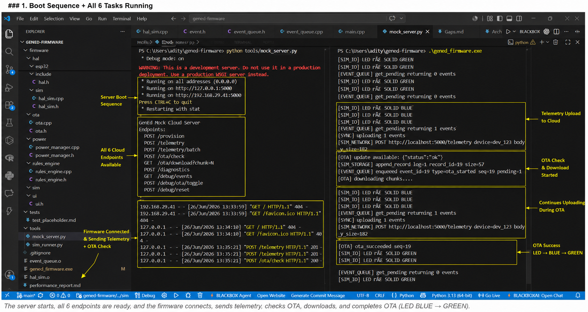
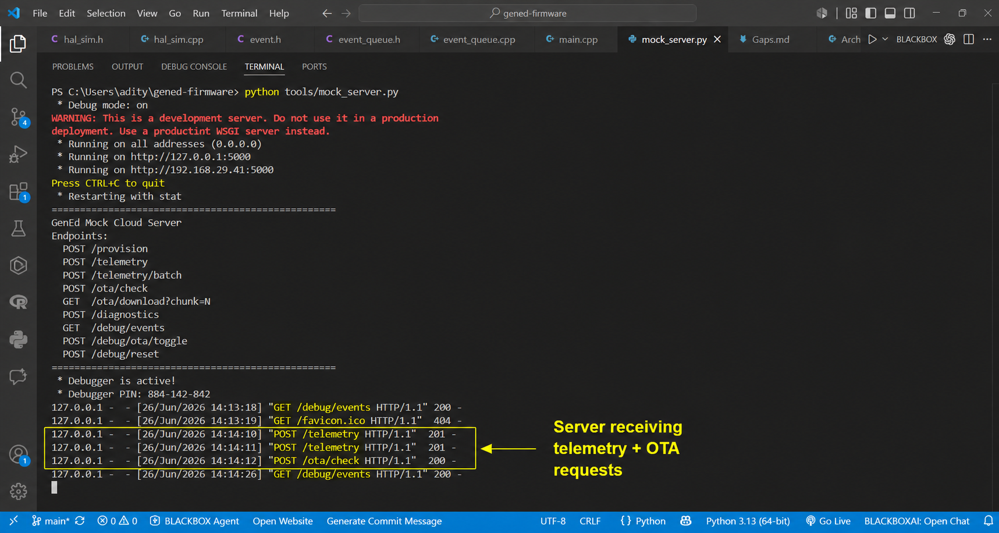
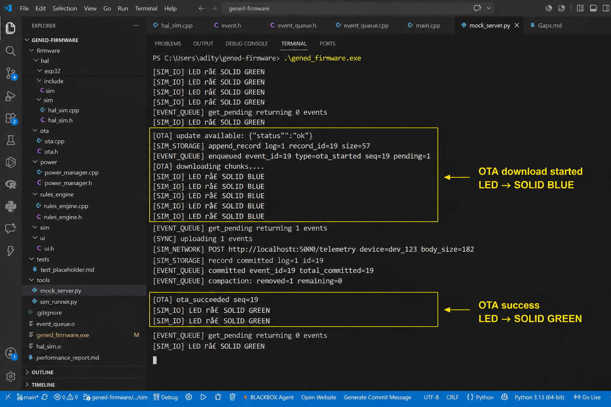
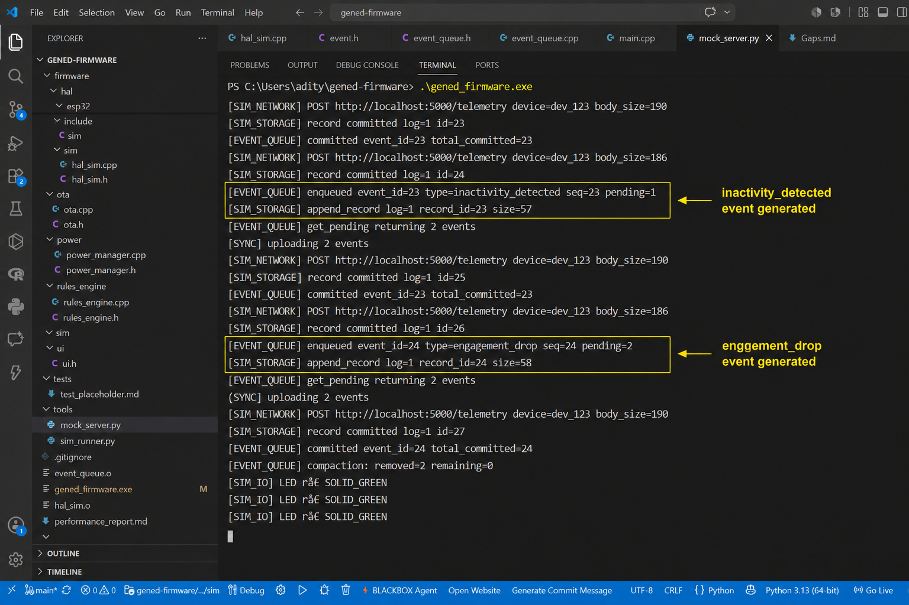
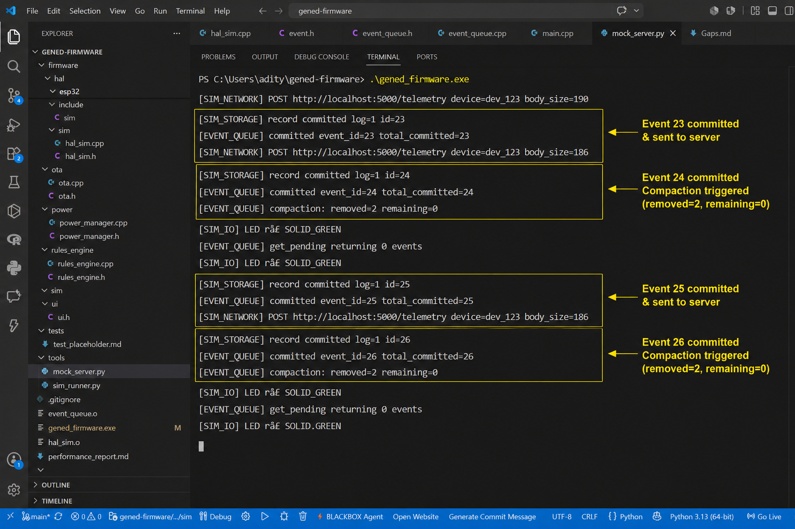
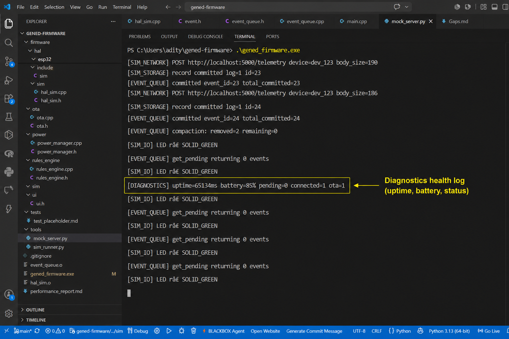

# GenEd Companion Firmware

Simulation-first firmware foundation for ESP32-class GenEd companion devices.

## Requirements
- Windows with MinGW (g++) OR Linux/Ubuntu
- Python 3.x
- Flask: `pip install flask`
- requests: `pip install requests`

## Build

```powershell
g++ -std=c++17 -I firmware/hal/include -I firmware/event_runtime firmware/hal/sim/hal_sim.cpp firmware/event_runtime/event_queue.cpp firmware/app_runtime/main.cpp -o gened_firmware.exe
```

## Run

Terminal 1 — Mock Server:
```powershell
python tools/mock_server.py
```

Terminal 2 — Firmware:
```powershell
.\gened_firmware.exe
```

Terminal 3 — Scenarios:
```powershell
python tools/sim_runner.py --list
python tools/sim_runner.py --scenario connectivity_loss
python tools/sim_runner.py --scenario full_demo
```

## Simulation in Action

These screenshots capture the current working simulation path end to end.

### Boot Sequence + All 6 Tasks Running


### Mock Cloud Receiving Telemetry + OTA Requests


### OTA Update Flow (BLUE -> GREEN)


### Inactivity + Engagement Drop Events


### Events Committing + Compaction


### Diagnostics Health Log


Working coverage shown:

- Boot sequence and all 6 tasks running
- Mock cloud endpoints receiving telemetry and OTA requests
- OTA update flow with LED state moving BLUE -> GREEN
- Derived events: `inactivity_detected` and `engagement_drop`
- Event commit path and queue compaction
- Diagnostics health logs for uptime, battery, pending events, connectivity, and OTA state

## Project Structure
```
firmware/hal/include/   — HAL interfaces (hal.h)
firmware/hal/sim/       — Simulation implementations
firmware/hal/esp32/     — ESP32 stubs (portability boundary)
firmware/app_runtime/   — Boot sequence + 6 RTOS tasks
firmware/event_runtime/ — Durable event queue
firmware/ota/           — OTA state machine
firmware/diagnostics/   — Metrics, traces, crash records
firmware/power/         — Battery state machine
firmware/connectivity/  — WiFi state management
firmware/rules_engine/  — Derived event detection
tools/mock_server.py    — Flask mock cloud server
tools/sim_runner.py     — Fault injection scenario runner
docs/                   — Architecture, gaps, memory budget
```
